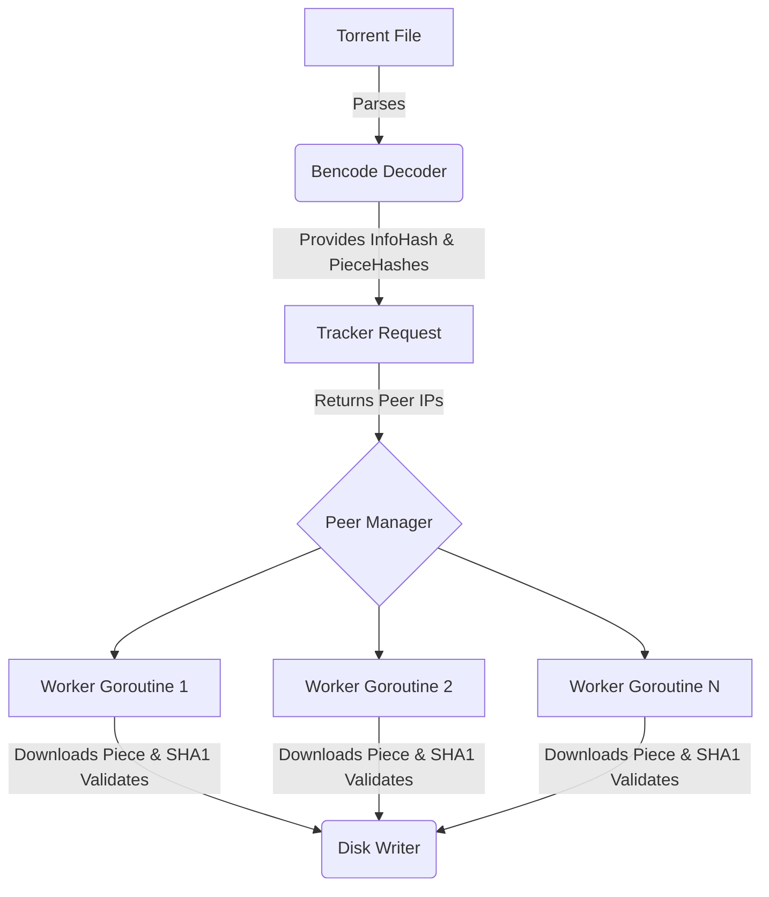

# Go-Bittorrent


Go-Bittorrent is a simple, concurrent BitTorrent client implemented in Go. It allows you to download files from the BitTorrent network by parsing `.torrent` files and connecting directly to peers via the BitTorrent protocol.

This project was built to explore network programming, parsing complex binary formats (Bencode/BitTorrent wire protocol), and leveraging Go's robust concurrency primitives to handle multiple TCP connections simultaneously.

## Features

- **Bencode Parsing**: Extracts and hashes metadata from `.torrent` files.
- **Concurrent Peer Connections**: Uses worker pools to securely download pieces from multiple peers at the same time.
- **Data Integrity Validation**: Validates downloaded pieces stream against SHA-1 hashes to prevent corruption.
- **Memory Optimized**: Directly writes validated pieces to disk via `os.File.WriteAt` to keep the memory footprint extremely low (supports streaming multi-gigabyte files).
- **Graceful Fault Tolerance**: Handles TCP timeouts, choking/unchoking, and unresponsive peers gracefully.

> **Note:** Currently, this client supports downloading single-file torrents over HTTP/TCP tracking.

## Architecture

At a high level, the client parses the `.torrent` file to identify the tracker and piece hashes. It fetches a list of peers from the tracker, then performs TCP handshakes. A job queue coordinates which goroutines download which pieces, and a result queue streams them safely into the output file.



## Challenges Faced

Building a BitTorrent client from scratch presented a few rewarding engineering challenges:
1. **Concurrency and State Management**: Managing connection state (choked vs. unchoked) across many peers requires careful synchronization. I solved this by isolating connection state into a `Client` struct and using Go Channels (`workQueue` and `resultQueue`) to orchestrate tasks, effectively avoiding complex mutexes and deadlocks.
2. **Binary Protocol Implementation**: The BitTorrent wire protocol communicates in strict byte streams without clear delimiters, meaning parsing requires exact byte reading and timeouts to prevent hanging on malicious or broken peers.
3. **Memory Management**: Rather than buffering an entire target file in memory—which could crash the program on a 4GB ISO—I transitioned to writing chunks concurrently to the disk using `WriteAt`, significantly lowering the program's memory footprint.

## Installation

Go 1.25 or higher is required. Alternatively, you can run the application entirely through Docker.

```bash
git clone https://github.com/pouyasadri/go-bittorrent.git
cd go-bittorrent
```

## Quick Start (Makefile)

A `Makefile` is provided to simplify common tasks.

```bash
make help          # View all available commands
make build         # Compile the Go application locally
make test          # Run all Go unit tests
make docker-build  # Build the Docker image
```

## Usage

You can run the client either locally or via a Docker container. In both cases, you must provide the source `.torrent` file and the output file name.

### 1. Running Locally
Assuming you ran `make build`:
```bash
./go-bittorrent <path-to-torrent-file> <output-path>
```

### 2. Running via Docker
Assuming you ran `make docker-build`. **Note**: The `Makefile` automatically handles volume mounting so the container can read torrents from and write files to your current local directory.
```bash
make docker-run TORRENT=your_file.torrent OUT=your_file.iso
```

**Example:**
> *(Optional: Add a GIF or screenshot of the terminal here showing the download progress)*

## Testing

The project includes tests to ensure the core parser and network abstractions are functional. To run the tests locally:

```bash
make test
```

## License
This project is licensed under the [MIT License](LICENSE).
