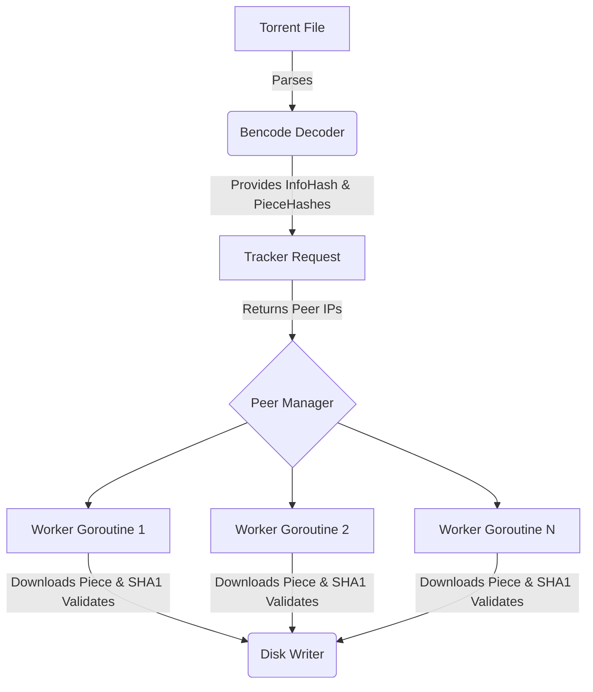

# Go-Bittorrent


Go-Bittorrent is a simple, concurrent BitTorrent client implemented in Go. It allows you to download files from the BitTorrent network by parsing `.torrent` files and connecting directly to peers via the BitTorrent protocol.

This project was built to explore network programming, parsing complex binary formats (Bencode/BitTorrent wire protocol), and leveraging Go's robust concurrency primitives to handle multiple TCP connections simultaneously.

## Features

- **Bencode Parsing**: Extracts and hashes metadata from `.torrent` files using high-performance parsing.
- **Concurrent Peer Connections**: Uses worker pools and goroutines to download pieces from multiple peers simultaneously.
- **Download Rate Limiting**: Features a built-in **Token Bucket ratelimiter** to throttle download speeds and manage bandwidth.
- **Data Integrity Validation**: Validates every downloaded piece against SHA-1 hashes to prevent data corruption.
- **Memory Optimized**: Directly writes validated pieces to disk via `os.File.WriteAt`, ensuring a low memory footprint even for multi-gigabyte files.
- **Enhanced UI**: Integrated with `pterm` for a modern, responsive terminal interface with debug messaging support.
- **Graceful Fault Tolerance**: Robust handling of TCP timeouts, choking/unchoking, and peer disconnections.

> **Note:** Currently, this client supports downloading single-file torrents over HTTP/TCP tracking.

## Architecture

The client parses the `.torrent` file to identify the tracker and piece hashes. It fetches a list of peers from the tracker, wraps connections in a `RateLimitedConn` if throttling is enabled, and performs TCP handshakes. A job queue coordinates piece downloads across worker goroutines, which stream validated data into the output file.



## Installation

Go 1.25 or higher is required. Alternatively, you can run the application entirely through Docker.

```bash
git clone https://github.com/pouyasadri/go-bittorrent.git
cd go-bittorrent
```

## Quick Start (Makefile)

A `Makefile` is provided to simplify common tasks.

```bash
make help          # View all available commands
make build         # Compile the Go application locally
make test          # Run all Go unit tests
make docker-build  # Build the Docker image
```

## Usage

The client uses a flag-based CLI. You must provide the source `.torrent` file as a positional argument and use flags to configure behavior.

### 1. Running Locally

```bash
./go-bittorrent --out=<output-file> [options] <path-to-torrent-file>
```

**Options:**
- `--out`: (Required) Path where the downloaded file will be saved.
- `--max-download`: Max download speed in KB/s (e.g., `1024` for 1MB/s). Set to `0` for unlimited.
- `--port`: Port to listen on for peer connections (default: `6881`).
- `--debug`: Enable detailed debug logging via `pterm`.

**Example:**
```bash
./go-bittorrent --out=debian.iso --max-download=2048 --debug debian.torrent
```

### 2. Running via Docker

The `Makefile` simplifies Docker execution including volume mounting.

```bash
make docker-run TORRENT=your_file.torrent OUT=your_file.iso
```

## Testing & Quality

The project maintains high standards for testing across core packages (`p2p`, `ratelimit`, `torrentfile`, etc.).

- **Run Tests**: `make test`
- **Coverage**: The project uses Go coverage tools. You can find coverage profiles (e.g., `coverage.out`) in the root directory.

## License

This project is licensed under the [MIT License](LICENSE).
